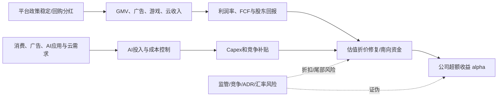

# 港股互联网中概科技与平台经济｜行业股价因果图谱 v3.1

> 用途：把“行业事件 → 行业变量 → 公司财务向量 → 估值和资金 → 超额收益”的路径显性化。  
> 重要说明：本文件是研究图谱模板，不构成投资建议；所有概率、权重、beta、门槛均为初始先验，需要用实时行情、公司财报、订单、资金流和估值数据校准。

---

## 0. 行业边界

港股互联网、中概科技、平台电商、本地生活、游戏、广告、云计算、AI应用、在线娱乐和恒生科技相关资产。

**核心判断：**该板块的核心是平台经济政策稳定、消费和广告修复、AI应用商业化、回购分红、南向/外资资金流和估值折价修复。需要同时看收入增长与资本开支压力。

---

## 1. 预测对象：不要直接预测裸股价，要预测超额收益

行业图谱重点解释的是公司剥离大盘与行业贝塔后的超额收益。

```text
r_i_h = market_beta_i × r_market_h + sector_beta_i × r_sector_h + alpha_i_h
```

| 项 | 含义 | 在本行业中的使用方式 |
|---|---|---|
| r_market_h | 大盘收益 | 先剥离市场风险偏好、流动性、指数涨跌 |
| r_sector_h | 行业或板块收益 | 剥离行业ETF或代表性指数涨跌 |
| alpha_i_h | 公司特异超额收益 | 由本图谱的订单、价格、毛利、估值、风险路径解释 |

---

## 2. 行业状态概率分布（初始先验）

| 行业状态 | 先验概率 | 含义 |
|---|---:|---|
| 结构分化 | 25% | 龙头和具备订单、技术壁垒的公司占优，题材公司折扣。 |
| 温和多头 | 25% | 景气改善但需业绩确认，估值扩张较克制。 |
| 估值修复 | 20% | 风险溢价下降或股东回报提升带来的估值折价收敛。 |
| 等待验证 | 20% | 叙事存在，但订单、利润或数据尚未确认。 |
| 杀估值 | 10% | 估值、拥挤度或利率环境压制，利好容易被兑现。 |

状态概率用于调节边的传导强度。

```text
edge_beta = Σ Pr(State=s) × beta(edge, horizon, state=s)
```

---

## 3. 核心因果图谱



---

## 4. 有效事件冲击模型

单个事件不要直接等同于股价利好，需要先扣除“预期内”和“已经反应”的部分。

```text
Shock_eff = Surprise_norm × Strength/5 × Novelty × Reliability × DataQuality × LagKernel × D_pre × D_post

D_pre  = (1 - PricedIn_pre / 5) ^ gamma
D_post = exp(-kappa × max(0, sign(Shock) × realized_return / (abs(model_return) + epsilon)))
```

### 本行业事件字段建议

| 字段 | 解释 | 数据来源或验证 |
|---|---|---|
| consensus_expectation | 分析师或市场的一致预期 | 研报、业绩前瞻、产业调研 |
| price_implied_expectation | 股价和估值中隐含的预期 | 事件前5、20、60日涨跌，成交额，ETF资金 |
| narrative_expectation | 市场叙事热度 | 新闻热度、社媒热度、路演反馈 |
| pre_event_runup | 事件前已上涨幅度 | 事件前5、20、60日收益 |
| post_event_reaction | 事件后已反应幅度 | 公告后或消息后收益 |
| remaining_impact | 剩余未定价影响 | 理论影响减去已反应影响 |
| data_quality | 数据质量 | 公告优于财报，财报优于订单，订单优于传闻 |
| tail_risk_prob | 尾部风险概率 | 监管、技术、客户、财务等风险 |

---

## 5. 主因果路径卡片

每条边采用正负不对称的传导函数。

```text
T(A to B, h)(x) = Gate_AB × Lag_AB(h) × [beta_positive_AB × max(x,0) + beta_negative_AB × min(x,0)]
```

| 路径组 | 因果链条 | 正向触发或验证 | 反向证伪 | beta_positive | beta_negative | 门槛 | 滞后 | 去重组 |
|---|---|---|---|---:|---:|---|---|---|
| 政策估值路径 | 平台政策稳定 → 风险溢价下降 → 估值折价修复 | 政策表述、监管事件、回购分红 | 监管趋严或突发事件 | 0.70 | 0.80 | 中：需市场资金确认 | 即时-2个季度 | 政策组 |
| 消费电商路径 | 消费修复 → GMV和广告收入增长 → 利润上修 | GMV、take rate、广告收入 | 消费疲弱、补贴加剧 | 0.70 | 0.75 | 中：收入和利润率需同步 | 1-4个季度 | 需求组 |
| AI应用路径 | AI产品提升转化/效率 → 广告、云和订阅收入改善 → 成长估值提升 | AI功能使用率、ARPU、云收入 | AI投入高但收入不明显 | 0.65 | 0.85 | 中高：必须证明商业化 | 2-6个季度 | 技术组 |
| 股东回报路径 | 回购/分红增加 → 每股价值提升 → 长线资金配置 | 回购规模、分红率、FCF | 盈利下滑导致回购不可持续 | 0.65 | 0.50 | 中：现金流安全是前提 | 即时-4个季度 | 资金组 |
| 成本控制路径 | 降本增效 → 费用率下降 → 利润弹性释放 | 费用率、员工数、营销支出 | 竞争加剧导致费用率反弹 | 0.60 | 0.65 | 中：利润率改善需可持续 | 1-4个季度 | 盈利组 |
| 竞争风险路径 | 补贴战/AI Capex上升 → 利润率承压 → 估值压缩 | 补贴率、Capex、毛利率 | 份额提升带来长期收益 | 0.50 | 1.05 | 中：利润率和现金流受压时触发 | 即时-4个季度 | 风险组 |

---

## 6. 路径去重：按驱动因素分组

多条路径可能来自同一源头，不能简单相加。建议按以下组别去重。

```text
需求组、价格组、成本组、政策组、技术组、竞争组、资金组、风险组

GroupImpact = Σ(w_p × PathImpact_p) / (1 + lambda_g × Σ Corr(p,q))
```

解释：同一组内路径越相关，重复计算折扣越大；独立路径越多，总影响才越强。

---

## 7. 公司暴露度模型

本行业公司暴露度建议重点看：

- 收入结构：电商、广告、游戏、云、本地生活
- AI投入与商业化能力
- 现金流和回购分红能力
- 用户规模和ARPU
- 竞争强度和补贴压力
- 南向/外资资金敏感度

统一公式：

```text
Exposure = Sign × RevenueShare^a × Directness × PassThrough × CompetitivePosition × GeoProductOverlap × MonetizationAbility × BalanceSheetCapacity
```

### 暴露度评分建议

| 分数 | 含义 |
|---:|---|
| 5 | 直接收入占比高、订单可验证、利润可传导、龙头地位强 |
| 4 | 直接受益，但收入占比或利润传导略弱 |
| 3 | 有业务关联，但对当期财务贡献不确定 |
| 2 | 更多是主题映射，商业化或订单弱 |
| 1 | 关系间接，难以形成财务贡献 |

---

## 8. 财务向量影响

不要只看EPS，尤其是高成长、周期底部或亏损公司。建议使用财务向量。

```text
Y = [Revenue, GrossMargin, OpexRatio, EBIT, EPS, FCF, ROE, Leverage]
```

| 财务向量 | 影响逻辑 |
|---|---|
| Revenue | GMV、广告、游戏流水、云收入驱动 |
| GrossMargin | 云和AI成本、补贴、产品结构影响 |
| OpexRatio | 营销、研发、降本增效 |
| EBIT/EPS | 费用率变化对利润弹性大 |
| FCF | 回购分红和AI Capex共同影响 |
| ROE | 成熟平台适用，云和AI投入会扰动 |

---

## 9. 混合估值模型

单一估值锚容易失真，建议使用混合估值。

```text
Value = Σ valuation_weight_m × ValueModel_m
```

| 估值模型 | 建议初始权重 | 使用场景 |
|---|---:|---|
| PE | 30% | 盈利稳定或进入利润兑现阶段。 |
| DCF/FCF | 25% | 成熟互联网平台和现金流型公司。 |
| PS | 20% | 高成长、利润尚未充分释放或亏损公司。 |
| SOTP | 20% | 业务结构复杂或多管线、多环节公司。 |
| 股息/回购模型 | 5% | 现金回报是估值支撑的公司。 |

估值倍数变化需要加入均值回归压力。

```text
Delta_ln_Multiple = beta_growth × Delta_Growth + beta_quality × Delta_Quality - beta_rate × Delta_Rate - beta_risk × Delta_Risk + beta_liquidity × Liquidity + beta_sentiment × Narrative - beta_priced × PricedIn - beta_crowding × Crowding - lambda_M × (ln_Multiple - ln_FairMultiple)
```

---

## 10. 尾部风险模型

本行业重点尾部风险：

- 监管或数据合规风险
- 竞争加剧导致补贴战
- AI Capex拖累现金流
- ADR和地缘风险
- 消费疲弱导致广告和GMV低于预期

尾部风险调整：

```text
mu_adjusted = mu_base - q_tail × LossSeverity - lambda_CVaR × CVaR
alpha_i_h = R_max_i_h × tanh(mu_adjusted_i_h / tau_h)
```

---

## 11. 验证指标清单

以下指标用于贝叶斯式更新路径有效性：

- GMV、take rate和广告收入
- 游戏流水和版号
- 云收入与AI产品商业化
- 毛利率和费用率
- 回购分红规模与FCF
- 南向资金和外资持仓
- 监管政策和竞争补贴

更新公式：

```text
logit(PathValid_t) = logit(PathValid_0) + Σ lambda_m × Signal_m_t
```

---

## 12. 反向证伪路径

每个正向逻辑必须对应证伪指标，避免只解释利好。

### 看多触发条件

- 收入和利润率同时改善
- 回购分红提高且FCF充足
- AI应用出现明确收入贡献
- 政策稳定带来风险溢价下降

### 看空或降权触发条件

- 补贴战扩大
- AI投入提升但商业化弱
- 消费和广告数据下滑
- 监管或地缘事件冲击估值

---

## 13. 可交易性输出面板

在接入实时数据后，每家公司或ETF输出以下结果：

| 输出项 | 计算方式 | 解释 |
|---|---|---|
| 预期超额收益 mu | 路径影响聚合减去风险惩罚 | 剥离大盘和行业后的预期收益 |
| 不确定性 sigma | 参数方差、路径方差、市场波动 | 越高表示判断越不稳定 |
| 上涨概率 | Phi(mu / sigma) | 不是确定涨跌，只是概率 |
| 可交易性 | mu / sigma 减去成本、流动性惩罚、拥挤惩罚 | 判断预期收益是否覆盖风险 |
| 剩余未定价影响 | 理论影响 × D_pre × D_post | 防止追高已经兑现的利好 |

示例输出格式：

```text
预期超额收益：待实时数据填充
不确定性：待实时数据填充
上涨概率：待实时数据填充
置信度：低、中、高，取决于验证指标
可交易性：强、一般、弱，取决于收益风险比、流动性、拥挤度
```

---

## 14. 简化落地流程

```text
1. 识别事件：政策、订单、价格、技术、财报、资金。
2. 计算 Surprise：实际变化减去多来源预期。
3. 扣除 D_pre 和 D_post：判断是否已经定价。
4. 通过主路径传导：需求、价格、成本、竞争、估值、风险。
5. 按相关性分组去重。
6. 映射到公司财务向量和混合估值模型。
7. 扣除尾部风险、流动性、交易成本和拥挤度。
8. 输出超额收益、上涨概率、置信区间和可交易性。
```

---

## 15. 一句话总结

**港股互联网中概科技与平台经济的图谱重点不是判断“这个行业好不好”，而是判断：利好是否超预期、是否已经反映、能否传导到公司财务、估值是否还有空间、尾部风险是否足以吞掉收益。**


---

