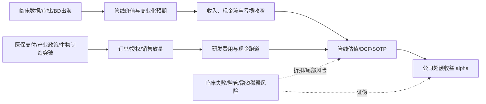

# 创新药生物医药与生物制造｜行业股价因果图谱 v3.1

> 用途：把“行业事件 → 行业变量 → 公司财务向量 → 估值和资金 → 超额收益”的路径显性化。  
> 重要说明：本文件是研究图谱模板，不构成投资建议；所有概率、权重、beta、门槛均为初始先验，需要用实时行情、公司财报、订单、资金流和估值数据校准。

---

## 0. 行业边界

创新药、Biotech、抗体/ADC/细胞治疗/基因治疗、CXO、医疗器械、疫苗、生物制造、合成生物、医药出海与BD授权。

**核心判断：**该板块的核心不是医药整体贝塔，而是临床数据、审批进度、海外授权、商业化放量和现金流安全。亏损公司不能用EPS弹性，需要用管线价值、现金跑道和亏损收窄。

---

## 1. 预测对象：不要直接预测裸股价，要预测超额收益

行业图谱重点解释的是公司剥离大盘与行业贝塔后的超额收益。

```text
r_i_h = market_beta_i × r_market_h + sector_beta_i × r_sector_h + alpha_i_h
```

| 项 | 含义 | 在本行业中的使用方式 |
|---|---|---|
| r_market_h | 大盘收益 | 先剥离市场风险偏好、流动性、指数涨跌 |
| r_sector_h | 行业或板块收益 | 剥离行业ETF或代表性指数涨跌 |
| alpha_i_h | 公司特异超额收益 | 由本图谱的订单、价格、毛利、估值、风险路径解释 |

---

## 2. 行业状态概率分布（初始先验）

| 行业状态 | 先验概率 | 含义 |
|---|---:|---|
| 结构分化 | 30% | 龙头和具备订单、技术壁垒的公司占优，题材公司折扣。 |
| 事件冲击 | 25% | 短期由政策、数据、产品、订单或临床事件驱动。 |
| 等待验证 | 25% | 叙事存在，但订单、利润或数据尚未确认。 |
| 温和多头 | 10% | 景气改善但需业绩确认，估值扩张较克制。 |
| 尾部风险 | 10% | 存在低概率高损失事件，需要单独建模。 |

状态概率用于调节边的传导强度。

```text
edge_beta = Σ Pr(State=s) × beta(edge, horizon, state=s)
```

---

## 3. 核心因果图谱



---

## 4. 有效事件冲击模型

单个事件不要直接等同于股价利好，需要先扣除“预期内”和“已经反应”的部分。

```text
Shock_eff = Surprise_norm × Strength/5 × Novelty × Reliability × DataQuality × LagKernel × D_pre × D_post

D_pre  = (1 - PricedIn_pre / 5) ^ gamma
D_post = exp(-kappa × max(0, sign(Shock) × realized_return / (abs(model_return) + epsilon)))
```

### 本行业事件字段建议

| 字段 | 解释 | 数据来源或验证 |
|---|---|---|
| consensus_expectation | 分析师或市场的一致预期 | 研报、业绩前瞻、产业调研 |
| price_implied_expectation | 股价和估值中隐含的预期 | 事件前5、20、60日涨跌，成交额，ETF资金 |
| narrative_expectation | 市场叙事热度 | 新闻热度、社媒热度、路演反馈 |
| pre_event_runup | 事件前已上涨幅度 | 事件前5、20、60日收益 |
| post_event_reaction | 事件后已反应幅度 | 公告后或消息后收益 |
| remaining_impact | 剩余未定价影响 | 理论影响减去已反应影响 |
| data_quality | 数据质量 | 公告优于财报，财报优于订单，订单优于传闻 |
| tail_risk_prob | 尾部风险概率 | 监管、技术、客户、财务等风险 |

---

## 5. 主因果路径卡片

每条边采用正负不对称的传导函数。

```text
T(A to B, h)(x) = Gate_AB × Lag_AB(h) × [beta_positive_AB × max(x,0) + beta_negative_AB × min(x,0)]
```

| 路径组 | 因果链条 | 正向触发或验证 | 反向证伪 | beta_positive | beta_negative | 门槛 | 滞后 | 去重组 |
|---|---|---|---|---:|---:|---|---|---|
| 临床数据路径 | 关键临床数据阳性 → 获批概率上升 → 管线价值重估 → 股价上行 | 主要终点、P值、安全性、竞品对比 | 临床失败或安全性问题 | 0.95 | 1.30 | 高：关键适应症和主要终点必须明确 | 即时-4个季度 | 事件组 |
| BD出海路径 | 海外授权/合作 → 预付款和里程碑 → 现金流改善与估值提升 | BD金额、区域权利、分成比例、合作方质量 | 条款弱、付款小、合作方不强 | 0.85 | 0.75 | 中高：预付款和条款质量比标题重要 | 即时-2个季度 | 资金组 |
| 商业化路径 | 获批上市 → 销售放量 → 收入和利润改善 → 估值模型切换 | 销售额、渗透率、医保准入、渠道覆盖 | 放量慢、价格下降、竞争加剧 | 0.75 | 0.80 | 中：需要真实销售和复购 | 2-8个季度 | 需求组 |
| CXO订单路径 | 全球研发投入恢复 → CXO订单回暖 → 收入与产能利用率提升 | 在手订单、新签订单、产能利用率 | 客户缩减研发预算 | 0.60 | 0.70 | 中：订单回暖需持续 | 2-6个季度 | 需求组 |
| 生物制造路径 | 合成生物/生物制造成本下降 → 新产品商业化 → TAM重估 | 单位成本、客户验证、规模化产线 | 成本优势不明显、产品需求小 | 0.65 | 0.85 | 中高：需从试验转商业订单 | 3-10个季度 | 技术组 |
| 尾部风险路径 | 临床失败/监管延迟/现金不足 → 融资稀释或估值压缩 | 现金余额、审评进度、临床结果 | 融资完成或数据修复 | 0.50 | 1.40 | 高：医药尾部风险不对称 | 即时-6个季度 | 风险组 |

---

## 6. 路径去重：按驱动因素分组

多条路径可能来自同一源头，不能简单相加。建议按以下组别去重。

```text
需求组、价格组、成本组、政策组、技术组、竞争组、资金组、风险组

GroupImpact = Σ(w_p × PathImpact_p) / (1 + lambda_g × Σ Corr(p,q))
```

解释：同一组内路径越相关，重复计算折扣越大；独立路径越多，总影响才越强。

---

## 7. 公司暴露度模型

本行业公司暴露度建议重点看：

- 核心管线权益和适应症空间
- 临床阶段和成功概率
- 海外授权与合作方质量
- 商业化能力与销售网络
- 现金跑道和融资需求
- 研发费用率与管线集中度

统一公式：

```text
Exposure = Sign × RevenueShare^a × Directness × PassThrough × CompetitivePosition × GeoProductOverlap × MonetizationAbility × BalanceSheetCapacity
```

### 暴露度评分建议

| 分数 | 含义 |
|---:|---|
| 5 | 直接收入占比高、订单可验证、利润可传导、龙头地位强 |
| 4 | 直接受益，但收入占比或利润传导略弱 |
| 3 | 有业务关联，但对当期财务贡献不确定 |
| 2 | 更多是主题映射，商业化或订单弱 |
| 1 | 关系间接，难以形成财务贡献 |

---

## 8. 财务向量影响

不要只看EPS，尤其是高成长、周期底部或亏损公司。建议使用财务向量。

```text
Y = [Revenue, GrossMargin, OpexRatio, EBIT, EPS, FCF, ROE, Leverage]
```

| 财务向量 | 影响逻辑 |
|---|---|
| Revenue | 商业化产品销售、授权收入、CXO订单 |
| GrossMargin | 药品价格、生产成本、产品结构 |
| OpexRatio | 研发和销售费用高，需看效率 |
| EBIT/EPS | 亏损公司不适合直接用EPS，应看亏损收窄 |
| FCF | 现金跑道、预付款和融资风险最关键 |
| ROE | 成熟药企适用，早期Biotech不适用 |

---

## 9. 混合估值模型

单一估值锚容易失真，建议使用混合估值。

```text
Value = Σ valuation_weight_m × ValueModel_m
```

| 估值模型 | 建议初始权重 | 使用场景 |
|---|---:|---|
| SOTP/管线估值 | 40% | 创新药、平台型或技术管线型公司。 |
| DCF | 25% | 现金流路径清晰、可做中长期折现。 |
| PS | 15% | 高成长、利润尚未充分释放或亏损公司。 |
| PE | 10% | 盈利稳定或进入利润兑现阶段。 |
| EV/EBITDA | 10% | 重资产、周期、设备或折旧影响较大的公司。 |

估值倍数变化需要加入均值回归压力。

```text
Delta_ln_Multiple = beta_growth × Delta_Growth + beta_quality × Delta_Quality - beta_rate × Delta_Rate - beta_risk × Delta_Risk + beta_liquidity × Liquidity + beta_sentiment × Narrative - beta_priced × PricedIn - beta_crowding × Crowding - lambda_M × (ln_Multiple - ln_FairMultiple)
```

---

## 10. 尾部风险模型

本行业重点尾部风险：

- 临床失败导致单日大幅回撤
- 融资稀释或现金跑道不足
- 医保降价影响盈利能力
- 竞品疗效或安全性更优
- 监管审批延迟

尾部风险调整：

```text
mu_adjusted = mu_base - q_tail × LossSeverity - lambda_CVaR × CVaR
alpha_i_h = R_max_i_h × tanh(mu_adjusted_i_h / tau_h)
```

---

## 11. 验证指标清单

以下指标用于贝叶斯式更新路径有效性：

- 临床主要终点和安全性数据
- NMPA/FDA/EMA审批进度
- 海外BD预付款和里程碑条款
- 医保准入和销售放量
- 现金余额和现金消耗速度
- CXO新签订单与产能利用率
- 竞品数据和价格变化

更新公式：

```text
logit(PathValid_t) = logit(PathValid_0) + Σ lambda_m × Signal_m_t
```

---

## 12. 反向证伪路径

每个正向逻辑必须对应证伪指标，避免只解释利好。

### 看多触发条件

- 关键临床数据显著优于竞品
- 高质量海外BD落地
- 获批后销售超预期
- 现金跑道明显延长

### 看空或降权触发条件

- 临床终点失败或安全性问题
- BD条款低于市场预期
- 商业化放量不及预期
- 现金消耗快且融资条件恶化

---

## 13. 可交易性输出面板

在接入实时数据后，每家公司或ETF输出以下结果：

| 输出项 | 计算方式 | 解释 |
|---|---|---|
| 预期超额收益 mu | 路径影响聚合减去风险惩罚 | 剥离大盘和行业后的预期收益 |
| 不确定性 sigma | 参数方差、路径方差、市场波动 | 越高表示判断越不稳定 |
| 上涨概率 | Phi(mu / sigma) | 不是确定涨跌，只是概率 |
| 可交易性 | mu / sigma 减去成本、流动性惩罚、拥挤惩罚 | 判断预期收益是否覆盖风险 |
| 剩余未定价影响 | 理论影响 × D_pre × D_post | 防止追高已经兑现的利好 |

示例输出格式：

```text
预期超额收益：待实时数据填充
不确定性：待实时数据填充
上涨概率：待实时数据填充
置信度：低、中、高，取决于验证指标
可交易性：强、一般、弱，取决于收益风险比、流动性、拥挤度
```

---

## 14. 简化落地流程

```text
1. 识别事件：政策、订单、价格、技术、财报、资金。
2. 计算 Surprise：实际变化减去多来源预期。
3. 扣除 D_pre 和 D_post：判断是否已经定价。
4. 通过主路径传导：需求、价格、成本、竞争、估值、风险。
5. 按相关性分组去重。
6. 映射到公司财务向量和混合估值模型。
7. 扣除尾部风险、流动性、交易成本和拥挤度。
8. 输出超额收益、上涨概率、置信区间和可交易性。
```

---

## 15. 一句话总结

**创新药生物医药与生物制造的图谱重点不是判断“这个行业好不好”，而是判断：利好是否超预期、是否已经反映、能否传导到公司财务、估值是否还有空间、尾部风险是否足以吞掉收益。**


---

